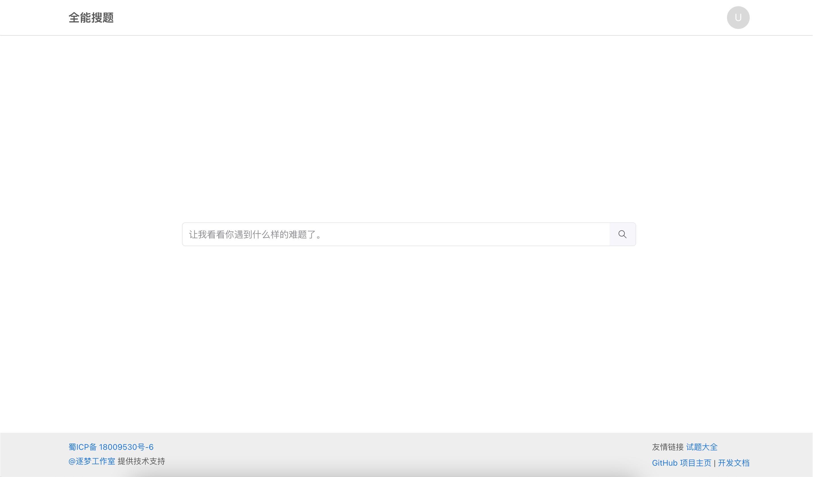
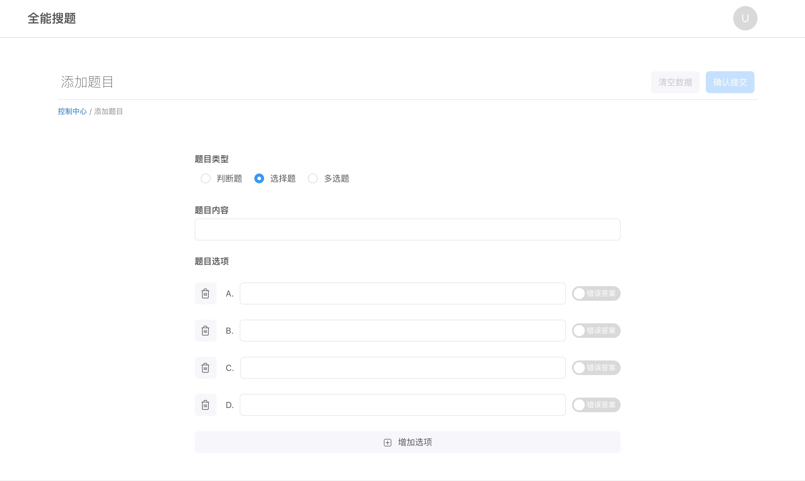

# 全能搜题网页端 🥤


全能搜题项目是一个基于开源社区公开贡献的永久免费搜题系统。我们欢迎任何有能力的小伙伴提交 PR 或参与开发与维护包括提 Issue。

全能搜题项目是一个前后端分离项目，该文档是基于搜题后端提供的免费公开 API 进行文档化整理，希望帮助各位开发者能够更好的利用搜题系统。如果您不想使用公开的搜题 API 也可以在自己的服务器上私有部署全能搜题系统（但是我们不建议这样做，我们希望能够尽可能搭建一个全网公开的免费搜题系统，充分利用社区力量集中完善题库资源）

最后感谢您的支持，我们更新的动力离不开您的支持与鼓励。🎉

全能搜题官网：<https://so.jszkk.com>

全能搜题接口开发文档（对接搜题接口参考这个文档）：<https://docsso.jszkk.com/>

全能搜题前端 GitHub 项目地址：<https://github.com/zmide/study.zmide.com>

全能搜题文档 GitHub 项目地址：<https://github.com/zmide/docs.study.zmide.com>

全能搜题 App 开源 GitHub 项目地址：<https://github.com/PBK-B/chaoxing-tool-client>

> 注: 全能搜题全部开源项目遵从 [MIT 许可协议开源](https://github.com/zmide/study.zmide.com/blob/main/LICENSE) ，任何人可以将其任意代码用于任何地方
>
> 免责声明: 受项目公开性质，作者以贡献者们不能保证数据来源是否合规，任何人都能提交搜索和使用系统的全部数据，在您使用该项目的任何服务时必须遵守相关国家法律法规并且本系统的全部文字在[知识共享 署名-相同方式共享 3.0 协议](https://creativecommons.org/licenses/by-sa/3.0/cn/deed.zh)之条款下提供，附加条款亦可能应用。（请参阅[使用条款](https://creativecommons.org/licenses/by-sa/3.0/cn/deed.zh)）

## 项目预览 🏙

<figure class="third">
  
</figure>

## 开发架构 🔧

> 前端主要使用 React + Typescript 技术栈开发，参与开发或贡献可以先了解相关开发技术。

**目录结构**

```
.
├── public             # 静态资源目录
├── build              # 编译输出目录（gitignore 忽略提交）
└── src                # 项目源代码根路径
    ├── scss           # 站点 scss 样式
    ├── api            # API 网络请求
    ├── stores         # Store 本地储存和 mobx 状态管理
    ├── routers        # react-router 前端路由处理
    ├── components     # 全局公用组件库
    ├── views          # 网站页面目录
    │   ├── home        # 首页
    │   ├── control     # 控制台相关页面
    │   ├── question    # 题目相关页面
    │   └── ……
    └── utils          # 工具函数库
```

**项目脚本**

> 运行或编译项目需要先安装 node 开发环境，并且有一定的前端开发经验。
>
> 可以使用 npm 或者 yarn 执行以下指令实现相同动作（下面将以 yarn 作为演示使用）。

```
yarn
# 安装项目依赖

yarn start
# 启动项目，打开 localhost:3000 可进行项目预览和调试

yarn build
# 构建项目，构建后将 build 目录中的文件发布到服务器即可完成项目部署

```

## QA 💡

Q: 不是说 90 行代码写的吗？为什么现在这么多代码了？

> A: 项目开始的时候只是简单实现搜题功能当然只有少量的代码，随着项目功能的增加我们完成了重构项目的架构（提高项目可维护性），增加更多功能使用 **代码是会不断增加的** 。如果你只需要搜题功能的话可以切换到第一个 Commit 查看和使用相关代码，链接如下：[Commit history fo 8a639d](https://github.com/zmide/study.zmide.com/tree/0b867a1d26dd3b9d44a59630d3f38bac688a639d/src/App.js)

Q: 我能使用该项目或者项目的搜题接口去做商业项目或者毕业设计吗？

> A: 全能搜题项目全部开源项目都是基于 MIT license 开源协议，你可以将其使用在任何地方没有任何限制。

Q: 我能使用该项目或者项目的搜题接口去做商业项目或者毕业设计吗？

> A: 全能搜题项目全部开源项目都是基于 MIT license 开源协议，你可以将其使用在任何地方没有任何限制。

Q: 自己的项目想使用全能搜题的后端接口，怎么对接搜题/提交题目的接口呢？

> A: 请参考全能搜题开放平台文档 <https://docsso.jszkk.com/>

Q: 为什么很多题目都搜不到？

> A: 全能搜题项目是一个基于开源社区公开贡献的永久免费搜题系统，主要是开源和免费公开一个搜题系统，题库资源需要靠大家一起提交维护和完善。（我们会持续在网络上爬取和解析一些题库，但是不能保证全都有）你可以将自己学校的题库贡献到系统中，如果您不会操作的话也可以将题库提交给我们，我们会使用代码将题目解析后提交到系统中。提交题库 QQ 群（不想公开发送到群里的话可以私发给群主或管理员）：`964722860`

Q: 想学习技术？

> A: 我们欢迎大家加入一起维护系统，网站，脚本等。有 Python，JavaScript，PHP，Java，Kotlin，Golang… 编程语言基础的都能在我们这里学习到以下技术：网站搭建，前端 React and Vue 技术，前端网站架构，后端 Laravel 框架，Python 数据处理，Android MVVM App 架构…（如果您还没任何编程语言基础的话可以先去选择一门编程语言学习基础，希望我们一起学习进步，与君共勉。）

## License

The project is open-sourced software licensed under the [MIT license](./LICENSE).
